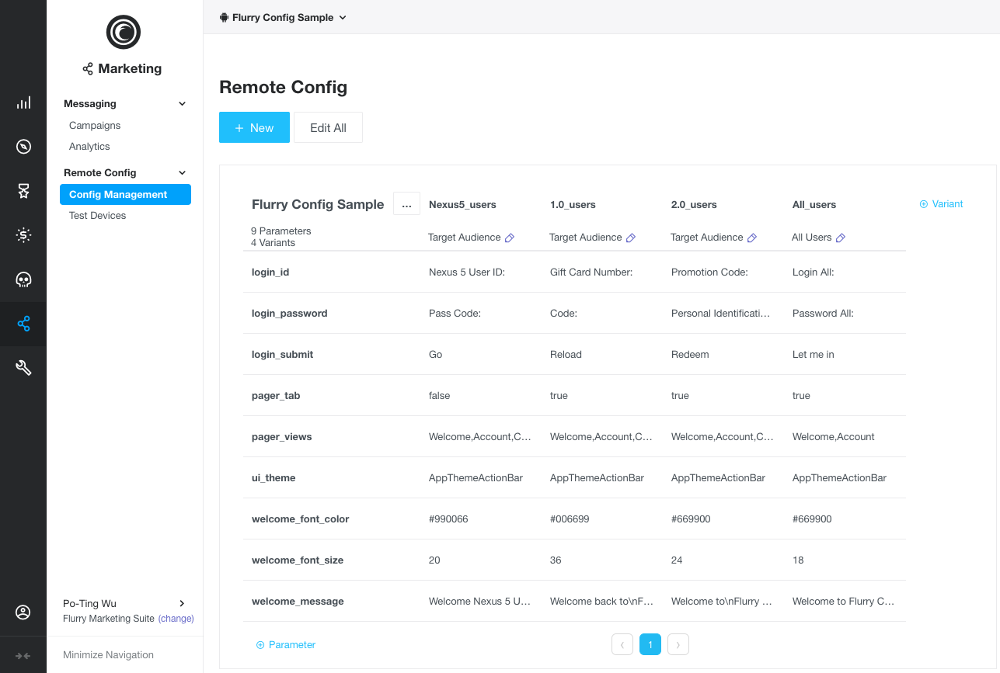
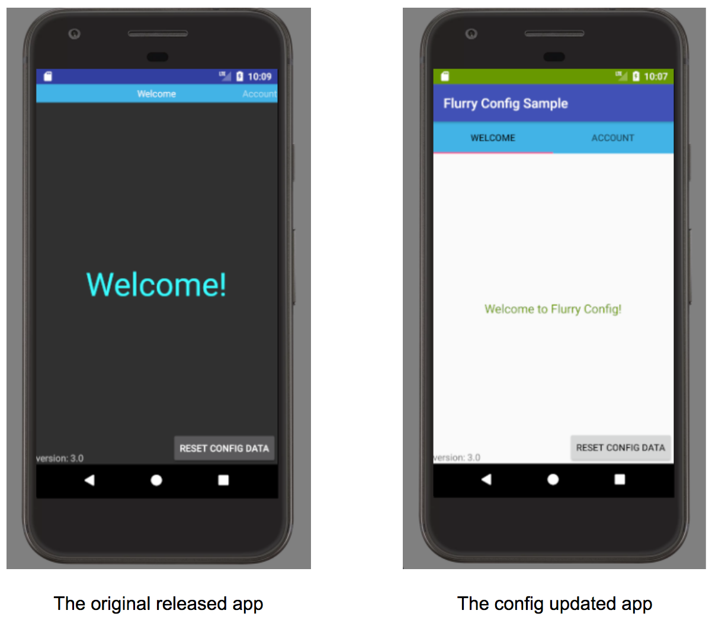
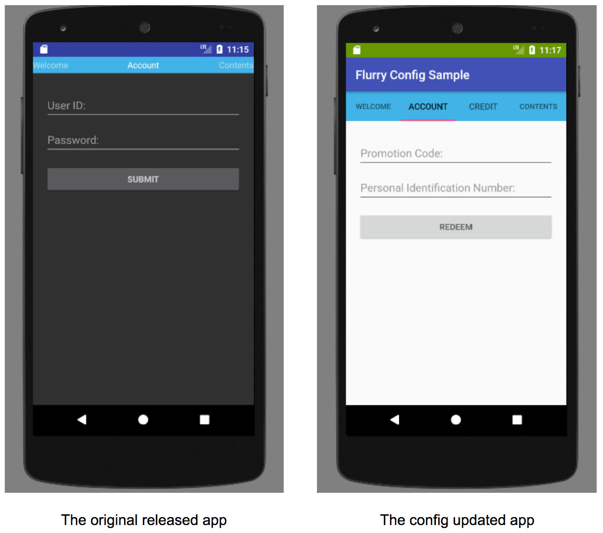

Flurry Remote Config Sample App
==============================

The Flurry Remote Config Sample app guide walks you through the steps involved
in integrating Flurry Config into your Android app.

Introduction
------------

The traditional app development process involves compiling an app, uploading to
an app store and releasing it to users. In order to move more quickly
Flurry Remote Config can enable the ability to tune the app experience after
it has shipped via a technology called Remote Configuration. Found a typo,
forgot to change button color or want to enable/ disable app features;
making these changes is simply changing values on Flurry Remote Config UI.
Product Managers, Growth Managers and non-technical team members can safely
make such changes. No need to wait for next app version release!

Create a project for Flurry
---------------

If you already have a Flurry project for Analytics or Ads, you may skip these steps.

Set up your project using the instructions provided in
[Integrate Flurry SDK for Android](https://developer.yahoo.com/flurry/docs/integrateflurry/android/).

1. Create an App and Get Your API Key
2. Add the following dependency to your app module's build.gradle:
   ```groovy
   implementation 'com.flurry.android:analytics:12.2.0@aar'
   ```
3. Add the following calls to initialize the Flurry SDK by using the FlurryAgent.Builder
   to initialize the Flurry SDK with your project’s API key.
   ```java
   new FlurryAgent.Builder().build(this, FLURRY_API_KEY);
   ```

Setup Flurry Config for project
---------------

The purpose of this section is to demonstrate the capabilities of Flurry Config for
remote configuration as well as provide a brief tutorial on the use of
the Flurry Remote Config APIs.

### Build and run the Flurry Config sample app

1. Download the Flurry Config sample code.
2. Open Android Studio.
3. Select **File > Open**, browse to where you extracted the sample code, and then open
   the **FlurryConfigSample** folder.
4. Build and run the sample app.
> You will need to replace with your own created Flurry API Key in your sample app
  in order to modify the config data.

Flurry Config SDK APIs
--------------

* **Fetch**: Retrieve the config data from the Flurry server.
* **Activate**: Apply the most recent config data received from the server.
* **Register/Unregister Listener**: Register and unregister a listener for the state of
  fetching and activating.
* **Getters**: Retrieves values from the active configuration.

Flurry Config Concepts
--------------

* **Cache**: Flurry Config caches values locally after the successful fetch.
  Before activating the new data received by the server, the available get methods
  will retrieve values from the cache.
* **Default Values**: With each getter, there is a default value that will be passed in.
  In some circumstances it is possible that a config will not be available. Providing
  a default allows Flurry Config to have a hard-coded fallback to ensure that the app
  is always in usable state. Example: user installs the app, but launches it when device
  is not connected to cellular network/ internet. It is also useful for testing.
* **Data Parsing**: All config values are stored as strings but for convenience,
  several getters are provided to allow the developer to interact with
  the Remote Config UI in an easier manner.

### Sample No. 1: Welcome message

This config sample provides an example of using Flurry Config to define the welcome message
of the sample app. Before running the sample, you should set up a Flurry Config project.
From [Flurry Analytics](https://y.flurry.com), navigate to the Flurry Remote Config UI
by clicking on the **Marketing** tab and **Remote Config** on the sidebar. Follow the
instructions to Set up a Flurry Config Project with the following parameters:

| Parameter key      | Example value             | Notes:                                    |
|--------------------|---------------------------|-------------------------------------------|
| welcome_message    | Welcome to Flurry Config! | Change to use a different welcome message |
| welcome_font_size  | 18                        | Change to use different font size         |
| welcome_font_color | #669900                   | Change to use different font color        |

After configuring your project, run the sample app to see the welcome message you defined
in the Flurry Remote Config console. You can change the values of these parameters
in the project and then restart the sample app to see how Remote Config lets you update an app.

#### Sample Codes (`WelcomeFragment.java`)

First, the sample gets a Flurry Config object instance and registers a listener.
The sample requests a `fetchConfig()` call to fetch values from the Remote Config server and
calls `activateConfig()` to make those values available to the app:

```java
    mFlurryConfig = FlurryConfig.getInstance();
    mFlurryConfigListener = new FlurryConfigListener() {
        @Override
        public void onFetchSuccess() {
            mFlurryConfig.activateConfig();
        }

        @Override
        public void onFetchNoChange() {
            // Use the Config cached data if available
        }

        @Override
        public void onFetchError(boolean isRetrying) {
            // Use the Config cached data if available
        }

        @Override
        public void onActivateComplete(boolean isCache) {
            // You can access your config values by calling one of the available get
            // methods on the FlurryConfig object. The default value will return
            // if this configuration is not available.
            // Now that the welcome message has been updated,
            // you can display the updated welcome message in the app.
            String text = mFlurryConfig.getString("welcome_message",
                    getResources().getString(R.string.welcome_message));
            welcomeMessage.setText(text);
        }
    };
    mFlurryConfig.registerListener(mFlurryConfigListener);

    // May skip the fetch request here if it’s already been done at other places.
    mFlurryConfig.fetchConfig();

```

Unregister your listener in your Fragment’s onDestroyView().

```java
    mFlurryConfig.unregisterListener(mFlurryConfigListener);
```

#### Caching

Flurry Config caches values locally after the successful fetch. Before activating
the new data received by the server, the available get methods will retrieve values
from the caches.
If your app do get new fetched data from the server even without activating it,
once the app returns, this cached data will be picked up during initialization
the next time around.

#### Fetching (`MainApplication.java`)

If your app needs to retrieve the config data from the server immediately as
in this sample, you can make a `fetchConfig()` request as early as in the app’s
main Application `onCreate()`. If your app requests fetch several times, requests
are throttled and your app is provided with cached values.

```java
    final FlurryConfig flurryConfig = FlurryConfig.getInstance();
    flurryConfig.registerListener(new FlurryConfigListener() {
        @Override
        public void onFetchSuccess() {
            flurryConfig.activateConfig();
        }

        @Override
        public void onFetchNoChange() {
        }

        @Override
        public void onFetchError(boolean isRetrying) {
        }

        @Override
        public void onActivateComplete(boolean isCache) {
        }
    });
    flurryConfig.fetchConfig();
```

#### Flurry Remote Config UI & Sample Apps

Below is the example Remote Config UI for the sample app. You will need to replace
with your own created Flurry API Key in your sample app in order to modify the config data.


Screenshots of the original released app and the config updated app.


### Sample No. 2: Login & Targeting

Flurry Config allows you to deliver different content to different users. For example,
you can decide to promote to your app users who are using app version 2.0.
You can specify the targetings on the Remove Config UI, and provide different text for labeling.

| Parameter key  | Example value                   | Notes:                                   |
|----------------|---------------------------------|------------------------------------------|
| login_id       | Promotion Code:                 | Change to use a different ID label       |
| login_password | Personal Identification Number: | Change to use a different password label |
| login_submit   | Redeem                          | Change to use a different submit label   |

#### Sample Codes (`LoginFragment.java`)

You do not need to request fetch everywhere. Normally you will put your fetch request
in the app’s main Application `onCreate()` method to trigger as early as possible.
Hence the newly retrieved config data will be ready when needed.

```java
    mFlurryConfig = FlurryConfig.getInstance();
    mFlurryConfigListener = new FlurryConfigListener() {
        @Override
        public void onFetchSuccess() {
            mFlurryConfig.activateConfig();
        }

        @Override
        public void onFetchNoChange() {
            // Use the Config cached data if available
        }

        @Override
        public void onFetchError(boolean isRetrying) {
            // Use the Config cached data if available
        }

        @Override
        public void onActivateComplete(boolean isCache) {
            loginId.setHint(mFlurryConfig.getString("login_id",
                    getResources().getString(R.string.login_id)));

            loginPassword.setHint(mFlurryConfig.getString("login_password",
                    getResources().getString(R.string.login_password)));
 
            loginSubmit.setText(mFlurryConfig.getString("login_submit",
                    getResources().getString(R.string.login_submit)));
        }
    };
    mFlurryConfig.registerListener(mFlurryConfigListener);
```

#### Registering Config Listener

Flurry Config SDK will maintain the Fetch-Activate-Notify-Get lifecycle consistently.
Therefore, if the fetching is already successful when you register a Config listener,
you will receive the `onFetchSuccess`/`onFetchNoChange`/`onFetchError()` notification
immediately. Likewise, you will receive the `onActivateComplete()` notification
right away if activated config data is already available, including both newly
fetched and cached data.

#### Unregistering Config Listener

Remember to unregister your listener when you no longer need it. A good practice of
registering and unregistering is to follow the Activity/Fragment’s lifecycle.
If you register your listener in Activity’s `onCreate()`, then unregister it in `onDestroy()`.
And if you register your listener in Fragment’s `onCreateView()`, then unregister it
in `onDestroyView()`.

Screenshots of the original released app and the config updated app.


### Sample No. 3: Pager Adapter & Workflow

By using Flurry Config, you not only can modify your app’s Pager style but you can also
adjust the Pager workflow. For example, the above app screenshots show that we changed
the original pager Title Strip style to pager Tab Layout and modified the workflow by
inserting an additional Credit tab for showing the promotion outcome.

| Parameter key | Example value                   | Notes:                                                        |
|---------------|---------------------------------|---------------------------------------------------------------|
| pager_tab     | true                            | Change to use a Pager Tab Layout instead of Pager Title Strip |
| pager_view    | Welcome,Account,Credit,Contents | Change to use a different workflow tabs                       |

#### Sample Codes (`MainActivity.java`)

Instead of updating the individual Pager’s fragment in the previous two examples,
we want to modify the whole Activity’s look and feel. Therefore we retrieve the config data
from the Activity’s `onCreate()` method.

```java
    mFlurryConfig = FlurryConfig.getInstance();
    mFlurryConfigListener = new FlurryConfigListener() {
        @Override
        public void onFetchSuccess() {
            mFlurryConfig.activateConfig();
        }

        @Override
        public void onFetchNoChange() {
            // Use the Config cached data if available
        }

        @Override
        public void onFetchError(boolean isRetrying) {
            // Use the Config cached data if available
        }

        @Override
        public void onActivateComplete(boolean isCache) {
            if (mFlurryConfig.getBoolean("pager_tab",
                    getResources().getBoolean(R.bool.pager_tab))) {
                findViewById(R.id.pager_strip).setVisibility(View.GONE);
                findViewById(R.id.pager_tab).setVisibility(View.VISIBLE);
            } else {
                findViewById(R.id.pager_strip).setVisibility(View.VISIBLE);
                findViewById(R.id.pager_tab).setVisibility(View.GONE);
            }

            pagerAdapter.updateViews(mFlurryConfig.getString("pager_views",
                    getResources().getString(R.string.pager_views)));
        }
    };
    mFlurryConfig.registerListener(mFlurryConfigListener);
```

#### Config Retrieving Locations

Flurry Config SDK is designed flexibly so that you can request fetch, activate,
and retrieve data from anywhere inside your apps. At the main Application level,
you can issue the fetch and activate calls so that the fetched data will be available as
soon as possible. If you are updating the whole Application/Activity features,
you can register the Config listener in the `onCreate()` method and unregister it
in the `onDestroy()` method. You can even register your listener and retrieve the data
in each Fragment’s `onCreateView()` method without depending on its parent Activity
which may be attached differently.

#### Config Data Parsing

All config values are stored as strings but for convenience, several getters are provided
to allow the developer to interact with the Remote Config UI in an easier manner.
These getters will follow the standard Java parsing schemes to convert as follows:

| Flurry Config Getter | Corresponding Parsing Scheme                                                                                                    |
|----------------------|---------------------------------------------------------------------------------------------------------------------------------|
| getBoolean           | [Boolean.parseBoolean(String)](https://docs.oracle.com/javase/8/docs/api/java/lang/Boolean.html#parseBoolean-java.lang.String-) |
| getInt               | [Integer.decode(String)](https://docs.oracle.com/javase/8/docs/api/java/lang/Integer.html#decode-java.lang.String-)             |
| getLong              | [Long.decode(String)](https://docs.oracle.com/javase/8/docs/api/java/lang/Long.html#decode-java.lang.String-)                   |
| getDouble            | [Double.parseDouble(String)](https://docs.oracle.com/javase/8/docs/api/java/lang/Double.html#parseDouble-java.lang.String-)     |
| getFloat             | [Float.parseFloat(String)](https://docs.oracle.com/javase/8/docs/api/java/lang/Float.html#parseFloat-java.lang.String-)         |

### Sample No. 4: Application Theme & Config Cache

For Android, there is no practical way to update overall application themes
after the app is started. Many approaches like restarting the Activity usually
introduced some unsmooth UI behaviors. If you want to change your app’s themes based on
the config data read, you can avoid restarting until the next time users rerun your apps.
Flurry Config will always cache the newly successfully fetched data even if
it is not activated. Therefore, when apps restart the next time, this cached data
will immediately be available for retrieving.

| Parameter key | Example value     | Notes:                                              |
|---------------|-------------------|-----------------------------------------------------|
| ui_theme      | AppThemeActionBar | Change to use AppThemeActionBar instead of AppTheme |

#### Sample Codes (`MainActivity.java`)

FlurryConfig's get methods are synchronized calls that will assure the cached data
been loaded before retrieving.
```java
    // Note: FlurryConfig's get methods are synchronized calls that will assure the
    // cached data been loaded before retrieving.
    mFlurryConfig = FlurryConfig.getInstance();
    if ("AppThemeActionBar".equals(mFlurryConfig.getString("ui_theme",
            getResources().getString(R.string.ui_theme)))) {
        setTheme(R.style.AppThemeActionBar);
    } else {
        setTheme(R.style.AppTheme);
    }
```

#### Delayed Cached & Aggressive Refreshing

Flurry Config not only can be used for updating UI look and feel but also can be used
for retrieving any backend data. You are always able to request a fetch call without
activating and using it immediately. Flurry Config will cache it and make it available
until the next run. For example, update apps' Theme and apply it at the next run,
or modify apps' preferences and database in the background, … On the contrary,
you can try to fetch and activate it in every Activity’s `onStart()` call. Hence
when the fetch time interval meets the threshold requirement and there is new config data,
your app will be updated immediately. For example, update promptly to guarantee
that your apps received your urgent patch immediately.

#### Workflow and Activate

For most use cases, the workflow is 1. Fetch, 2. Activate, and 3. Get data
in the listener. Under this scheme, only `onFetchSuccess` and `onActivateComplete`
are used as described in the previous examples.

However, Config listeners will receive `onActivateComplete` notification
when cache data been read and when newly fetched data been activated.
For apps that prefer to get Config data and refresh just once, they can apply only
the final data by using the notification flag `isCache`.
```java
    mFlurryConfig = FlurryConfig.getInstance();
    mFlurryConfigListener = new FlurryConfigListener() {
        @Override
        public void onFetchSuccess() {
            mFlurryConfig.activateConfig();
        }

        @Override
        public void onFetchNoChange() {
            // Use the Config cached data if available
            onActivateComplete(false);
        }

        @Override
        public void onFetchError(boolean isRetrying) {
            // Use the Config cached data if available
            If (!isRetrying) {
                onActivateComplete(false);
            }
        }

        @Override
        public void onActivateComplete(boolean isCache) {
            If (!isCache) {
                // Get the final Config data
            }
        }
    };
    mFlurryConfig.registerListener(mFlurryConfigListener);
    mFlurryConfig.fetchConfig();
```

#### Config Getters Default Values

With each getter, there is a default value that will be passed in. In some circumstances
it is possible that a config will not be available. Providing a default allows
Flurry Config to have a hard-coded fallback. It is also useful for testing.

Support
-------

- [Flurry Developer Support Site](https://developer.yahoo.com/flurry/docs/)

License
-------

Copyright 2018 Oath Inc.

Licensed under the Apache License, Version 2.0 (the "License");
you may not use this file except in compliance with the License.
You may obtain a copy of the License at

  http://www.apache.org/licenses/LICENSE-2.0

Unless required by applicable law or agreed to in writing, software
distributed under the License is distributed on an "AS IS" BASIS,
WITHOUT WARRANTIES OR CONDITIONS OF ANY KIND, either express or implied.
See the License for the specific language governing permissions and
limitations under the License.
